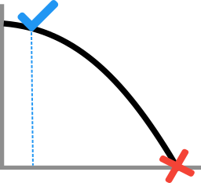

<div align="center">
  <br>
</div>

# Temporis : Time-series utilities for predictive maintenance
-----------------

[](https://coveralls.io/github/lucianolorenti/Temporis)
[](https://lucianolorenti.github.io/Temporis/)

## What is it?

**Temporis** is a Python package that provides a set of tool for handling time-series datasets in the context of predictive maintenance.


## Main Features

* PM Time series dataset handling
* Feature extraction in a time-series-wise approach

The main part of the library if the transformation graph that can be define in order to select, extract and transform features of each of the time series.

In the following example 2 features (featureA and featureB) are the input and the target is the column price. 
For transforming the input features:

1. First we remove outliers based on the interquantile range.
2. Then we compute the kurtosis using a rolling window of 50 samples. 
3. Finally scale everything into (-1, 1)
   
The transformer can be fitted in a training set, and then the fitted transformed can be used later for transforming the validation and test set.

```python
features = ['featureA', 'featureB']
X_transformations = ByNameFeatureSelector(features)
X_transformations = IQROutlierRemover()(X_transformations)
X_transformations = PerColumnImputer()(X_transformations)
X_transformations = RollingStatisticsPandas(window=50, to_compute=['kurtosis'])(X_transformations)
X_transformations = PandasMinMaxScaler((-1,1), robust=False)(X_transformations)


y_transformation = ByNameFeatureSelector(['price'])

transformer = Transformer(
    transformerX=X_transformations,
    transformerY=y_transformation)

transformer.fit(train_dataset)

iterator = WindowedDatasetIterator(
  dataset.map(transformer),
  window_size=64,
  step=32,
  shuffler=AllShuffled()
  sample_weight=NotWeighted(),
)
```


## Where to get it
The source code is currently hosted on GitHub at:
https://github.com/lucianolorenti/Temporis

```sh
pip install temporis
```

 Made with <3 @   <a href="https://www.dei.unipd.it/">  
         
      </a>
